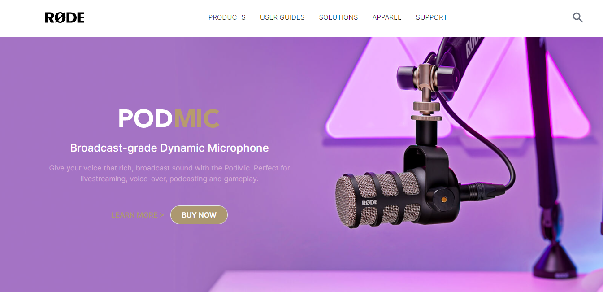

# Project-1:  **Rode-Clone**
# Technology Used :   

##  **About** :- 
In this Project, i have used HTML, CSS and Tailwind CSS  creatd  a fully responsive ***Rode-clone***. As a beginner project, i have lerned lots of new CSS classes  like- relative, items-center,  hidden etc and differnt color classes. 

## [***Project-live-Link-->***]() 

##  **Website Preview-->**

## Thank you for visiting.. also ckeck-out my next Projects & please share your valuable Feedback 👍👍   
